# 🚀 Terraform: Mount S3 Bucket on EC2 (Ubuntu) using s3fs‑fuse

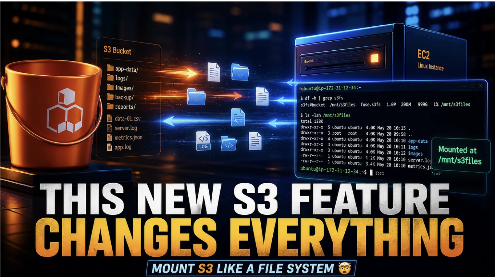

This project automates the creation of an S3 bucket, an EC2 instance (Ubuntu 22.04), an IAM role with S3 permissions, and the automatic mounting of the bucket as a local file system using s3fs‑fuse. It uses Terraform to provision the infrastructure and a user‑data script to configure the mount on the instance.

## 📖 Overview
When you need to access S3 objects as if they were local files (e.g., for legacy applications, log processing, or shared storage), s3fs‑fuse is a reliable solution. This repository provides a complete, production‑ready Terraform setup that:

Creates an S3 bucket with versioning enabled (optional) and public access blocked.

Launches an Ubuntu 22.04 LTS EC2 instance with a public IP.

Attaches an IAM role that grants read/write access to the bucket.

Installs s3fs‑fuse and mounts the bucket to /mnt/s3-bucket automatically on startup.

Adds an entry to /etc/fstab to persist the mount across reboots.

All resources are tagged, well‑structured, and easy to destroy when no longer needed.

## 🗂️ Project Structure

```bash
├── provider.tf          # Terraform and AWS provider configuration
├── variables.tf         # Input variables (bucket name, key name, region, etc.)
├── terraform.tfvars     # (create yourself) – actual variable values
├── data.tf              # Ubuntu 22.04 AMI lookup
├── s3.tf                # S3 bucket, versioning, and public access block
├── iam.tf               # IAM role, policy, and instance profile
├── security-groups.tf   # Security group (SSH and HTTP access)
├── ec2.tf               # EC2 instance + Elastic IP (optional)
├── userdata.sh          # Script to install s3fs and mount the bucket
├── outputs.tf           # Public IP, DNS, bucket name, mount point
└── README.md            # This file
```

🧠 Architecture Diagram

```bash
+-------------------+      +-------------------+
|     Terraform     |      |   AWS Cloud       |
|   (your machine)  |      |                   |
+--------+----------+      |  +-------------+  |
         |                  |  |   S3 Bucket  |  |
         | terraform apply  |  | (versioning) |  |
         +----------------->|  +------^------+  |
                             |         |         |
                             |  +------+------+  |
                             |  |   EC2       |  |
                             |  | Ubuntu 22.04|  |
                             |  | s3fs-fuse   |  |
                             |  | /mnt/s3-*   |  |
                             |  +-------------+  |
                             |         |         |
                             |  IAM Role (S3 access)
                             +-------------------+
```

## 🧰 Prerequisites

Terraform (≥ 1.0)

AWS CLI configured with credentials having permissions to create EC2, S3, IAM, and security groups.

An existing EC2 key pair in your AWS account (for SSH access).

Basic knowledge of AWS and Terraform.

## ⚙️ Setup & Deployment

### 1. Clone the repository

```bash
git clone https://github.com/joebaho2/S3-FILES-TF.git
```

```bash
cd S3-FILES-TF
```


### 2. Create terraform.tfvars

Create a file named terraform.tfvars with your specific values:

```bash 
aws_region   = "us-east-1"
bucket_name  = "my-unique-bucket-name-12345"   # must be globally unique
key_name     = "your-existing-key-pair-name"
instance_type = "t2.micro"                    # free tier eligible
mount_point   = "/mnt/s3-bucket"              # customise if needed
```


### 3. Initialize Terraform

```bash
terraform init
```

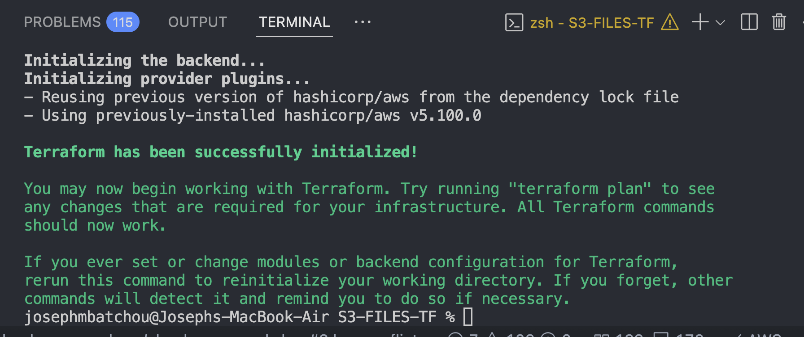  

### 4. Review the plan

```bash
terraform plan
```

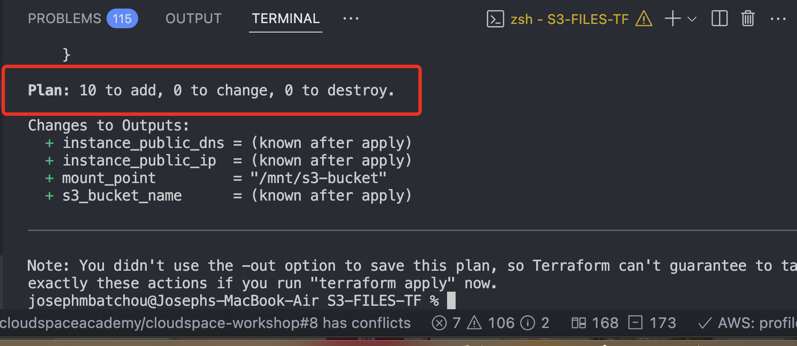  

### 5. Apply

```bash
terraform apply -auto-approve
```

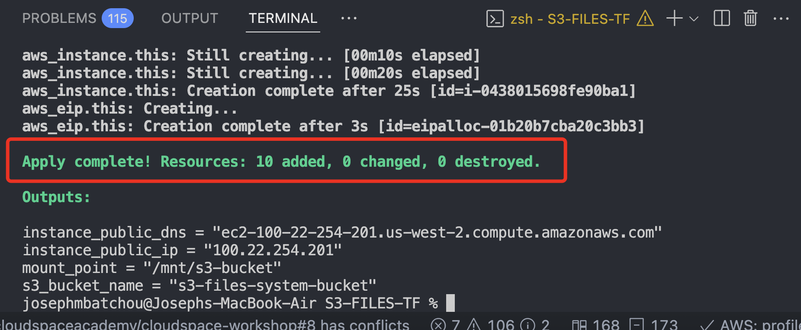  

After completion, Terraform outputs the public IP, bucket name, and mount point. You can go to console to see all reesources that were created

EC2 Instance

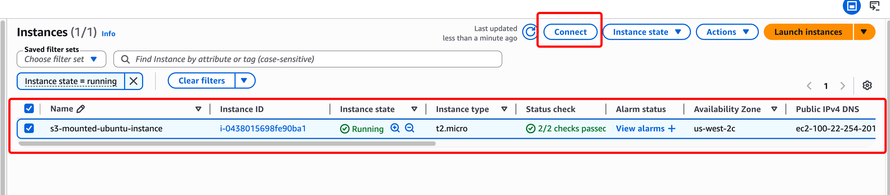  

S3 Bucket

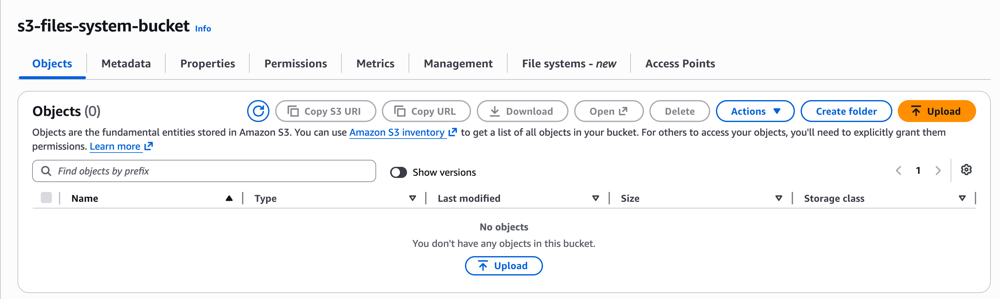  


### 6. Connect to the instance

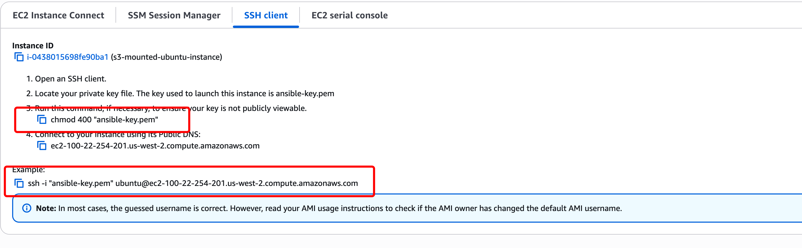  

```bash
ssh -i your-key.pem ubuntu@$(terraform output -raw instance_public_ip)
```

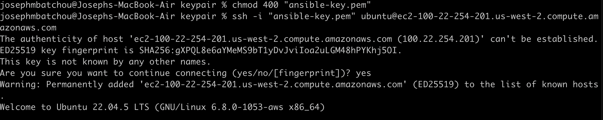  

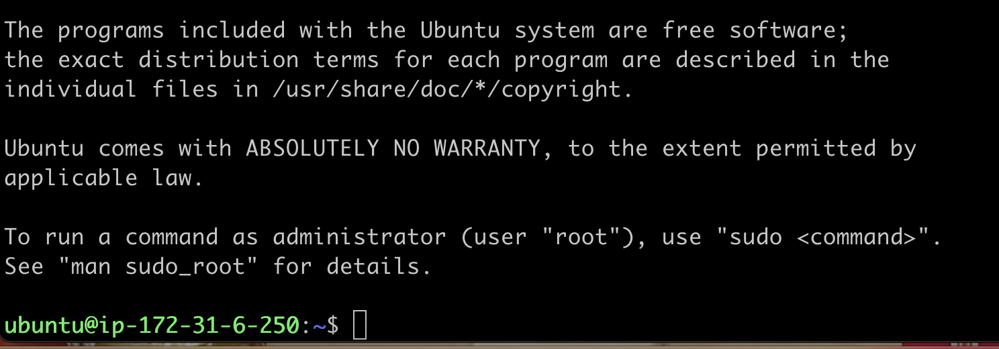  

### 7. Verify the mount

```bash
df -h | grep s3fs
ls -la /mnt/s3-bucket
echo "Hello from EC2" | sudo tee /mnt/s3-bucket/test.txt
```

The command "echo" will created a file via cli that will be sent to the mountedd s3 bucket. 

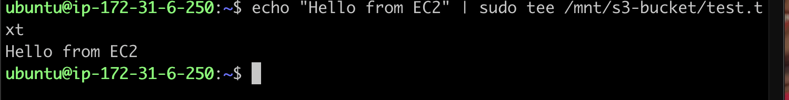  

We can see that the file appear in the s3 bucket.

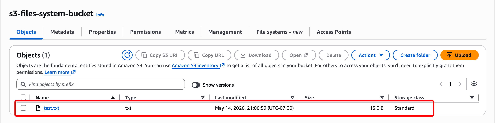  

Now we upload a files via the console

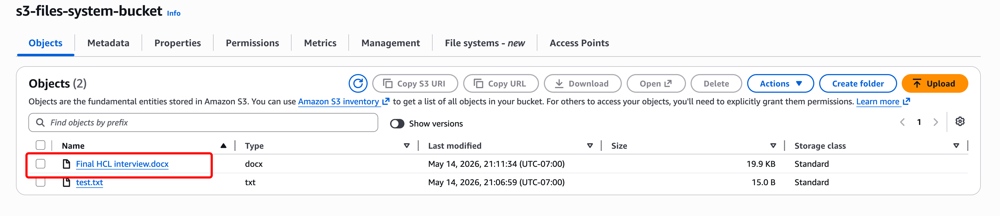  

Check via cli that the file is there

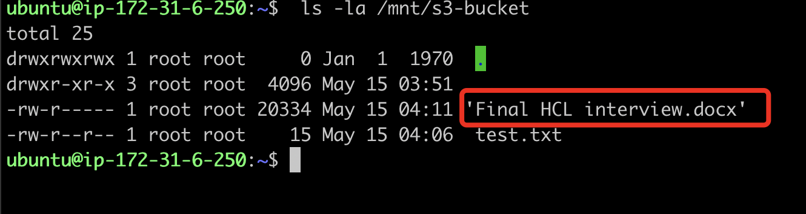  

You can now read and write files – they are directly stored in S3.

## 🧼 Clean Up
To avoid ongoing charges, destroy all resources:

```bash
terraform destroy -auto-approve
```

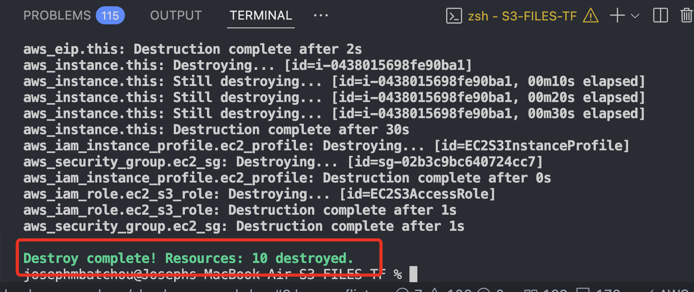  

Note: The S3 bucket is configured with force_destroy = true. This will delete all objects and versions inside the bucket before removing the bucket itself. Use with caution – data cannot be recovered.

## 🛠️ Customisation

| Variable     | Description      | Default         |
|------------- |----------------- |-----------------|
| AWS_region   | AWS region.      | us-west-2       |
| bucket_name  | Unique S3 bucket | Required        |
| key_name.    | EC2 key pair name| Required        |
| instance_type| Ec2 instance type| t3.micro.       |
| mount_point  | Local directory  | /mnt/s3-bucket  |
|              | for the mount    |                 |

You can also adjust the security group ingress rules in security-groups.tf (e.g., restrict SSH to your IP).

## 🔧 Troubleshooting

The mount point is empty or the bucket is not mounted
Check the user‑data script logs on the instance:

```bash
sudo cat /var/log/cloud-init-output.log
```

Manually install s3fs and mount:

```bash
sudo apt update && sudo apt install -y s3fs
sudo s3fs <bucket-name> /mnt/s3-bucket -o allow_other,use_cache=/tmp,iam_role=auto
```

Verify the IAM role is attached to the instance (AWS Console → EC2 → Instance → IAM role = EC2S3AccessRole).

Terraform destroy fails because bucket is not empty
The s3.tf file includes force_destroy = true. If you removed it, manually empty the bucket first:

```bash
aws s3 rm s3://<bucket-name> --recursive
```

Permission denied when writing to mount point
Ensure the ubuntu user has write permissions:

```bash
sudo chmod 777 /mnt/s3-bucket   # not recommended for production
```

## 🤝 Contribution

Pull requests are welcome. For major changes, please open an issue first.

## 👨‍💻 Author

**Joseph Mbatchou**

• DevOps / Cloud / Platform  Engineer   
• Content Creator / AWS Builder

## 🔗 Connect With Me

🌐 Website: [https://platform.joebahocloud.com](https://platform.joebahocloud.com)

💼 LinkedIn: [https://www.linkedin.com/in/josephmbatchou/](https://www.linkedin.com/in/josephmbatchou/)

🐦 X/Twitter: [https://www.twitter.com/Joebaho237](https://www.twitter.com/Joebaho237)

▶️ YouTube: [https://www.youtube.com/@josephmbatchou5596](https://www.youtube.com/@josephmbatchou5596)

🔗 Github: [https://github.com/Joebaho](https://github.com/Joebaho)

📦 Dockerhub: [https://hub.docker.com/u/joebaho2](https://hub.docker.com/u/joebaho2)

---

## 📄 License

This project is licensed under the MIT License — see the LICENSE file for details.
